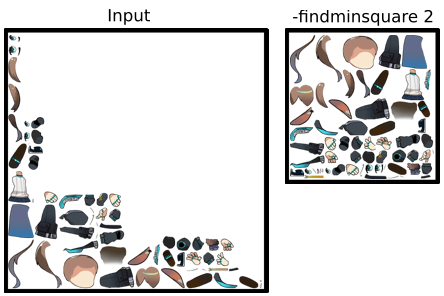

# Atlas Repacker



This is a tool made to identify pixel islands in image(s) and repack them onto a new canvas of a specified size, with optional padding between such islands.

A pixel is considered real for island detection purposes if it has alpha > 0, so you'll probably be using this tool on PNGs

actual packing is deferred to https://github.com/nothings/stb/blob/master/stb_rect_pack.h

I needed this for some specific AI training, it might not fit your needs.

## Features

- supports loading png, webp, gif
- can detect pixel islands itself, or via [atlas files](https://en.esotericsoftware.com/spine-atlas-format) (currently xy, size, bounds & rotate properties are used, however only rotate values of true, false or 90 are implemented.)
- can expand margins to fairly consume all available space in output
- can find the minimum size for output

## Building/Installing

[Go](https://go.dev) and [cgo](https://github.com/go101/go101/wiki/CGO-Environment-Setup) are required, then simply:

```bash
go install github.com/crimro-se/atlas-repacker@latest
```

I'll add binaries when the project matures.

## Usage

```
atlas-repacker [flags] [input.png] [input2.png ...]
Flags:
  -align int
        how to align a box within its margin?
        0 = top left, 1 = center, 2 = bottom right (default 1)
  -atlas
        when set, loads pixel region information from .atlas files with same name
  -debug
        when set, writes a debug.png image demonstrating all detected/loaded islands
  -diagonal
        when set, diagonally adjacent pixels are considered connected during island detection.
  -findmaxmargin
        when set, will find the largest margin value for which all islands still fit in the output.
  -findminsquare int
        If set > 0, finds the smallest output image size for which w and h is a multiple of this value.
  -h int
        height of output image (default 512)
  -margin int
        margin to use for each box (default 1)
  -o string
        filename of output (default "output.png")
  -w int
        width of output image (default 512)
```

## Batch Processing Example

My preference is to use the [parallel](https://www.gnu.org/software/parallel/) command, as the {} substitution values are extremely convenient, as is the joblog.
```bash
find test_data/1/ -iname '*.png' -print0 | parallel -0 --joblog log.txt  ./atlas-repacker -w 1024 -h 1024 -atlas -findmaxmargin -o "test_data/1_out/{/.}_repacked.png" "{}"

perl -ane '$F[6] and print' < log.txt > err.log
```

## TODO

- add chroma mask support
- enhance .atlas file support